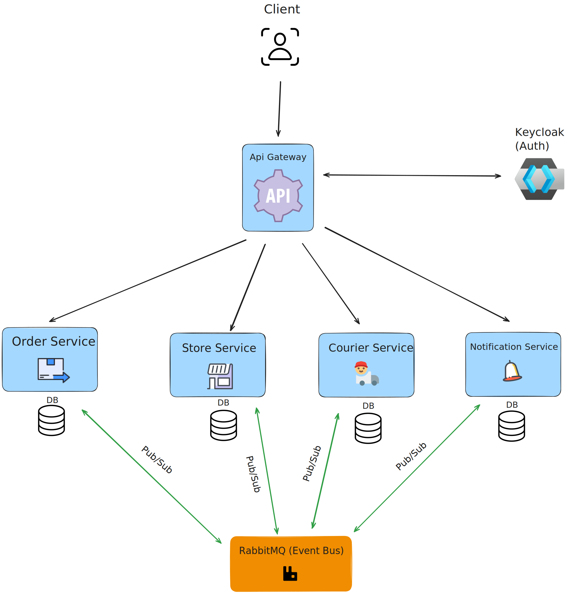
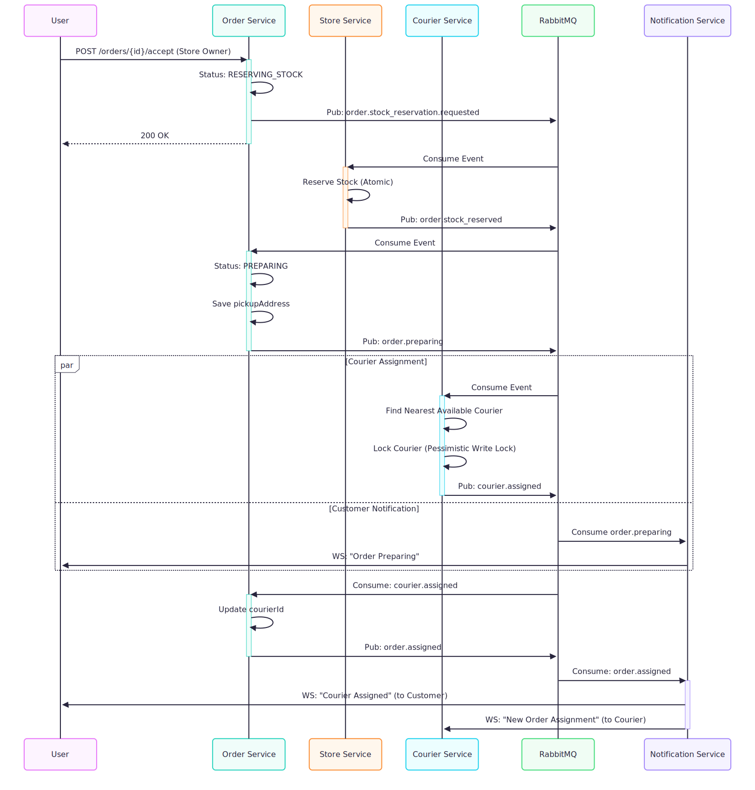

# YADS - Yet Another Delivery Service


An event-driven microservices platform for delivery operations. Built to solve real distributed systems challenges: the Dual-Write Problem, race conditions, and data consistency across services.



## Key Engineering Decisions

### Dual-Write Problem → Transactional Outbox Pattern

The classic problem: you can't atomically write to a database and publish to a message queue without 2PC (which has its own issues).

**Implementation:** Events are saved to an `outbox` table in the same transaction as business data. A scheduled job polls the outbox and publishes to RabbitMQ, marking events as processed. This guarantees at-least-once delivery.

```java
// Same transaction: business logic + event
orderRepository.save(order);
outboxRepository.save(new OutboxEvent("order.created", payload));
// Background job publishes to RabbitMQ every 2 seconds
```



### Race Conditions → Database Locking Strategies

**Courier Assignment (Pessimistic Locking):**
Two orders can't claim the same courier simultaneously. Uses `SELECT ... FOR UPDATE` to lock the courier row during assignment.

```java
@Lock(LockModeType.PESSIMISTIC_WRITE)
Optional<Courier> findByIdForUpdate(UUID id);
```

**Order State Transitions (Optimistic Locking):**
Prevents lost updates when concurrent processes modify the same order. Uses `@Version` annotation.

```java
@Version
private Long version;
```

### Saga Pattern with Compensation

When a step fails (e.g., no stock available), the system triggers compensation transactions to rollback previous steps.

.svg)

### Ghost Inventory Prevention

A subtle bug: if stock wasn't actually reserved (order was in PENDING state), the cancellation shouldn't release stock. The compensation logic checks the order's actual state before restoring inventory.

.svg)

### Idempotent Message Processing

Every consumer implements "First Writer Wins" with a dedicated idempotency table. Duplicate messages from RabbitMQ are detected and skipped.

```java
if (!tryCreateIdempotencyKey(eventKey)) {
    log.warn("Event already processed. Skipping.");
    return;
}
```

## Architecture Overview


| Service | Responsibility | Patterns Used |
|---------|---------------|---------------|
| **Order Service** | Order lifecycle, saga orchestration | Optimistic Locking, State Machine |
| **Store Service** | Inventory management, stock reservation | Compensation Transactions, Idempotency |
| **Courier Service** | Courier assignment, availability | Pessimistic Locking, Geo-distance calculation |
| **Notification Service** | Real-time push notifications | WebSocket/STOMP, JWT Auth |
| **User Service** | User management | OAuth2 Integration |
| **API Gateway** | Routing, authentication | Spring Cloud Gateway, OAuth2 Resource Server |

## Order Flow

The happy path: Order Created → Stock Reserved → Courier Assigned → Delivered.




## Tech Stack

| Layer | Technology |
|-------|------------|
| **Runtime** | Java 21 (Virtual Threads ready) |
| **Framework** | Spring Boot 3.5.6, Spring Cloud 2025.0.0 |
| **Messaging** | RabbitMQ with Dead Letter Queues |
| **Database** | PostgreSQL 16 (per-service schema) |
| **Auth** | Keycloak (OAuth2/OIDC), JWT |
| **Service Discovery** | Eureka |
| **Tracing** | Zipkin, Micrometer, OpenTelemetry |
| **Real-time** | WebSocket with STOMP protocol |
| **Testing** | JUnit 5, Testcontainers (real Postgres/RabbitMQ) |
| **Infrastructure** | Docker Compose |

## Running Locally

```bash
# Clone
git clone https://github.com/devwelkin/yads.git
cd yads

# Build and start all services
docker-compose up -d --build
```

| Service | URL |
|---------|-----|
| API Gateway | http://localhost:9000 |
| Eureka Dashboard | http://localhost:8761 |
| RabbitMQ Management | http://localhost:15672 |
| Zipkin Tracing | http://localhost:9411 |
| Keycloak Admin | http://localhost:8700 |

## Testing

```bash
mvn package --file pom.xml
```

No external setup required. Testcontainers spins up ephemeral PostgreSQL and RabbitMQ instances automatically for each test run. This proves the system is self-contained—clone, test, done.

## Project Structure

```
yads/
├── api-gateway/          # Spring Cloud Gateway
├── eureka/               # Service Discovery
├── order-service/        # Order management & saga
├── store-service/        # Inventory & products
├── courier-service/      # Courier assignment
├── notification-service/ # WebSocket notifications
├── user-service/         # User management
├── common/               # Shared DTOs & contracts
└── docker-compose.yml    # Full stack orchestration
```

## TODO

- [ ] **Terraform AWS infrastructure** - ECS/EKS deployment, RDS, Amazon MQ
- [ ] Auto-reset courier status to `AVAILABLE` after `order.delivered` or `order.cancelled`
- [ ] Expand test coverage for failure scenarios (`stock_reservation_failed`, courier assignment failures)

## Known Limitations

- Courier remains `BUSY` after order completion. A status endpoint exists for manual updates; automatic reset is planned.
- Failure path tests (`order.stock_reservation_failed`, courier-assignment-failure) need more coverage.
